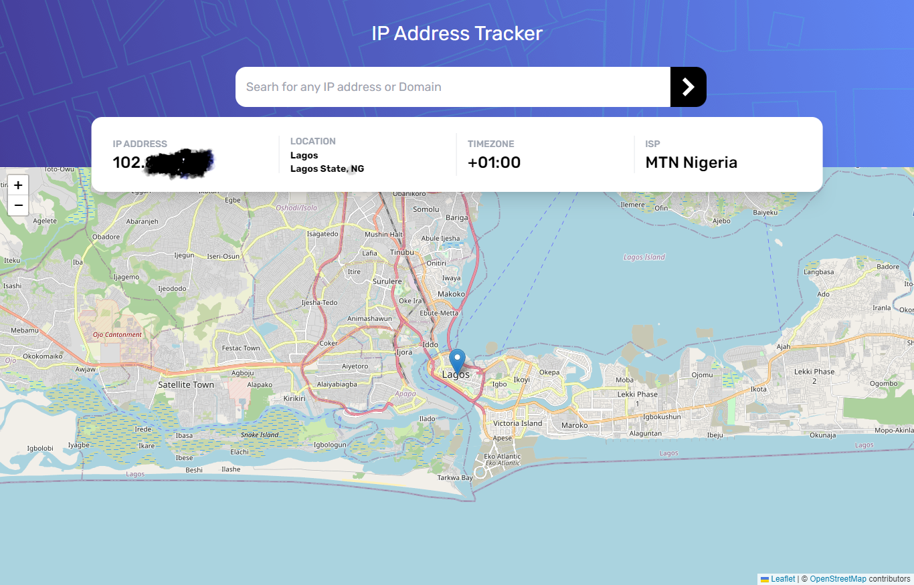

# Frontend Mentor - IP address tracker solution

This is a solution to the [IP address tracker challenge on Frontend Mentor](https://www.frontendmentor.io/challenges/ip-address-tracker-I8-0yYAH0). Frontend Mentor challenges help you improve your coding skills by building realistic projects.

## Table of contents

- [Overview](#overview)
  - [The challenge](#the-challenge)
  - [Screenshot](#screenshot)
  - [Links](#links)
- [My process](#my-process)
  - [Built with](#built-with)
  - [Useful resources](#useful-resources)
- [Author](#author)
- [Acknowledgments](#acknowledgments)

## Overview

### The challenge

Users should be able to:

- View the optimal layout for each page depending on their device's screen size
- See hover states for all interactive elements on the page
- See their own IP address on the map on the initial page load
- Search for any IP addresses or domains and see the key information and location

### Screenshot

### Links

- Solution URL: [Add solution URL here](https://github.com/Samsegun/ip-address-tracker)
- Live Site URL: [Add live site URL here](https://samsegun-ip-tracker.netlify.app)

## My process

### Built with

- Mobile-first workflow
- [React](https://reactjs.org/) - JS library
- [React Leaflet](https://react-leaflet.js.org/) - For generating maps
- [IP Geolocation Api](https://geo.ipify.org/) - For getting ip information
- [Tailwind Css](https://tailwindcss.com/) - For styling

### Useful resources

- [Stackoverflow](https://stackoverflow.com/questions/63740794/deploy-failed-netlify) - This helped me when deploying the app on netlify due to "build fail" and react-leaflet missing dependency.
- [React-leaflet-docs](https://react-leaflet.js.org/docs/start-setup/) - The react-leaflet official documentation.

## Author

- Website - [Add your name here](https://github.com/Samsegun/)
- Frontend Mentor - [samsegun](https://www.frontendmentor.io/profile/samsegun)
- Twitter - [olusegun oye](https://www.twitter.com/datsleumas)

## Acknowledgments

Big Shout-out to the Frontendmentor team. You guys rock!!!
